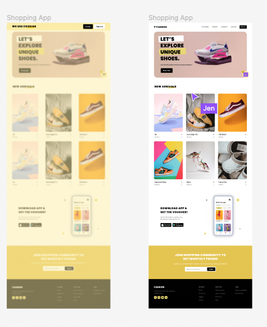

js-vertiefung_schuh shop

Eine Übung im SuperCode Bootcamp

## 🎓 Aufgabe

```

Heute erstellst du einen Schuh-Online-Shop.
Das Figma-Layout findest du hier und den Prototypen kannst du dir hier angucken.

Die Inhalte der Seite werden statisch über das HTML eingefügt. Nur die Liste mit den angebotenen Schuhen (unter der Überschrift “New arrivals”), fügst du über das JavaScript ein. Dafür findest du unten in den Kommentaren ein Array, was verarbeitet werden soll.

Die restlichen Bilder und Icons findest du im Classroom.
```

```
Bonus 1:

Erstelle ein Overlay für den Warenkorb, das zum Style der Website passt.
Das Overlay wird angezeigt, wenn man auf den Warenkorb Button unten rechts klickt.
Wenn noch kein Objekt im Warenkorb ist, steht in dem Overlay: “The cart is empty”, sobald man ein Paar Schuhe zum Warenkorb hinzugefügt hat, wird der Name und die Marke als ein Element in deinem Overlay angezeigt.

```

## 💡 Assets

```

Zusatz: Page ist komplett Responsive
```

## 📸 Screenshots




## 💻 Running

Zur Seite —> - [Lev3_21_js-vertiefung_schuh shop](https://jennijennina.github.io/js_vertiefung_schuh-shop/)

<p align="left">
</p>

<h3 align="left">Languages and Tools:</h3>
<p align="left"> <a href="https://www.w3schools.com/html/" target="_blank" rel="noreferrer">  </a>
<a href="https://www.w3schools.com/css/" target="_blank" rel="noreferrer">  </a> 
<a href="https://www.w3schools.com/css/" target="_blank" rel="noreferrer">  </a> </p>
